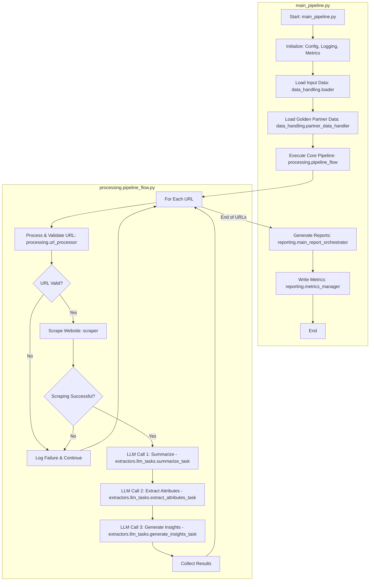

# Project Architecture Overview

This document provides a high-level overview of the project's architecture, explaining the purpose of each module and detailing the end-to-end pipeline flow.

## Module Descriptions

The project is organized into several packages, each with a specific responsibility.

### `src/core`

This package contains the foundational components of the application.

*   **`config.py`**: Defines the `AppConfig` class, which loads configuration settings from the `.env` file. This allows for easy management of application parameters without modifying the code.
*   **`constants.py`**: Stores constant values used throughout the project, such as predefined lists, mappings, or default settings.
*   **`logging_config.py`**: Configures the application's logging, setting up log formats, levels, and output handlers (e.g., file and console).
*   **`schemas.py`**: Defines the data structures and schemas used for type hinting and data validation, likely using Pydantic or dataclasses. This ensures data consistency throughout the pipeline.

### `src/data_handling`

This package is responsible for all data input and preprocessing.

*   **`loader.py`**: Handles the initial loading and preprocessing of data from the input file (e.g., an Excel or CSV file).
*   **`consolidator.py`**: Contains functions for consolidating data, such as generating canonical base URLs from various inputs.
*   **`partner_data_handler.py`**: Manages the loading and summarization of "golden partner" data, which is used for comparison in the final LLM step.

### `src/extractors/llm_tasks`

This package contains the modules that define and execute specific tasks using the Large Language Model (LLM).

*   **`summarize_task.py`**: Generates a concise summary of the text scraped from a website.
*   **`extract_attributes_task.py`**: Extracts structured company attributes (e.g., industry, services) from the summary generated by `summarize_task.py`.
*   **`generate_insights_task.py`**: Compares the extracted attributes against the golden partner data to generate sales insights and a "match rationale."

### `src/llm_clients`

This package manages communication with the LLM provider.

*   **`gemini_client.py`**: Implements a client to interact with the Google Gemini API, handling API requests, responses, and error management.

### `src/processing`

This package contains the core logic for processing the data.

*   **`pipeline_flow.py`**: Orchestrates the main data processing loop, iterating through each row of the input data and executing the sequence of scraping and LLM tasks.
*   **`url_processor.py`**: Handles the validation, cleaning, and normalization of input URLs before they are passed to the scraper.
*   **`outcome_analyzer.py`**: (Purpose inferred) Likely analyzes the final outcomes of the pipeline for reporting or metrics.

### `src/reporting`

This package is responsible for generating all output reports and metrics.

*   **`csv_reporter.py`**: A specialized module for creating CSV reports.
*   **`main_report_orchestrator.py`**: Coordinates the generation of all final reports, including summary reports and detailed analyses.
*   **`metrics_manager.py`**: Manages the collection and writing of run-time metrics, such as processing times, success rates, and failure counts.
*   **`report_generator.py`**: Provides generic functions for creating various types of reports.

### `src/scraper`

This package handles all web scraping functionality.

*   **`scraper_logic.py`**: Contains the core logic for navigating and extracting content from websites.
*   **`page_handler.py`**: Manages interactions with web pages, such as finding links and extracting text.
*   **`scraper_utils.py`**: Provides utility functions to support the scraping process.

### `src/utils`

This package contains miscellaneous helper functions used across the project.

*   **`helpers.py`**: A collection of general-purpose helper functions.
*   **`llm_processing_helpers.py`**: Helper functions specifically related to processing data for or from the LLM.

## End-to-End Pipeline Flow

The entire process is initiated and managed by `main_pipeline.py`, which uses the other modules to execute the A-to-Z pipeline.

### **Step-by-Step Breakdown:**

1.  **Initialization (`main_pipeline.py`)**:
    *   The `main()` function is the entry point.
    *   It initializes the `AppConfig` to load settings from `.env`.
    *   It sets up logging using `src/core/logging_config.py`.
    *   A unique `run_id` is generated, and output directories are created.

2.  **Data Loading (`main_pipeline.py`)**:
    *   The main input data (e.g., `deduped_urls.xlsx`) is loaded into a pandas DataFrame using `src/data_handling/loader.py`.
    *   The "golden partner" data is loaded and summarized using `src/data_handling/partner_data_handler.py`.

3.  **Core Processing (`processing.pipeline_flow.py`)**:
    *   The `execute_pipeline_flow` function is called from `main_pipeline.py`.
    *   It iterates through each row of the input DataFrame.
    *   For each row, it performs the following steps:
        *   **URL Processing**: The input URL is validated and cleaned by `src/processing/url_processor.py`.
        *   **Web Scraping**: If the URL is valid, the `src/scraper` module is used to scrape the website's content.
        *   **LLM Chain**: If scraping is successful, the scraped text is passed through a three-stage LLM process, orchestrated by functions in `src/extractors/llm_tasks`:
            1.  A summary is generated.
            2.  Detailed attributes are extracted from the summary.
            3.  Sales insights are generated by comparing the attributes to the golden partner data.
        *   **Failure Handling**: Failures at any stage are logged, and the pipeline continues with the next row.

4.  **Reporting (`main_pipeline.py`)**:
    *   After the main loop in `pipeline_flow.py` is complete, the results are passed to `src/reporting/main_report_orchestrator.py`.
    *   This module generates the final output reports, such as `ProspectAnalysisReport.csv`.
    *   Finally, `src/reporting/metrics_manager.py` writes a summary of the run's metrics to a file.