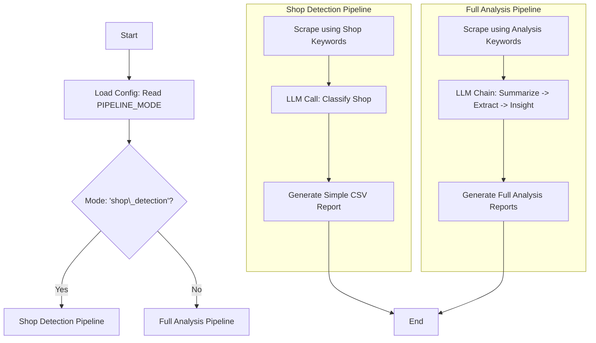

# Modular Pipeline Refactoring Plan

This document outlines the plan to refactor the existing pipeline into a modular framework. This will enable different operational modes, starting with the existing "full analysis" and a new "shop detection" mode.

## I. High-Level Goal

Transform the current, linear pipeline into a flexible, configuration-driven platform. This will allow for easier maintenance, testing, and addition of new capabilities in the future.

## II. Core Concept: Pipeline Modes

The central idea is to introduce a `PIPELINE_MODE` setting in the configuration. This setting will control which sequence of tasks is executed, what data is generated, and how the final report is formatted.

## III. Detailed Task Breakdown

Here are the specific tasks required to implement this refactoring, with an assessment of their complexity and difficulty.

### **1. Enhanced Configuration**

*   **Task**: Add new settings to `.env.example` and `src/core/config.py` to manage the pipeline mode and mode-specific parameters.
*   **Details**:
    *   Introduce `PIPELINE_MODE` to select the execution path ("full\_analysis" or "shop\_detection").
    *   Add settings for the "shop\_detection" mode, including `SHOP_DETECTION_TARGET_KEYWORDS`, `PROMPT_PATH_SHOP_DETECTION`, and `SHOP_DETECTION_OUTPUT_FILENAME_TEMPLATE`.
*   **Complexity**: Low
*   **Difficulty**: Easy. This involves adding new variables and loading them in the `AppConfig` class, which follows an established pattern in the code.

### **2. Scraper Adaptation**

*   **Task**: Modify the core scraping function to accept a list of target keywords as a parameter.
*   **Details**: The function signature in `src/scraper/scraper_logic.py` (likely `scrape_website`) will be updated. The pipeline will then pass the appropriate keyword list (`shop_detection_target_keywords` or the original keywords) based on the selected `PIPELINE_MODE`.
*   **Complexity**: Low
*   **Difficulty**: Easy to Medium. The change itself is small, but it requires careful verification to ensure the new parameter is passed correctly through any intermediate function calls.

### **3. New "Is Shop" LLM Task & Prompt**

*   **Task**: Create the new LLM prompt and the Python function to handle the "is shop" classification.
*   **Details**:
    *   Create `prompts/shop_detection_prompt.txt` with instructions for the LLM.
    *   Create a new file, `src/extractors/llm_tasks/is_shop_task.py`, with a `classify_is_shop` function that calls the LLM and parses the JSON response.
*   **Complexity**: Low
*   **Difficulty**: Easy. This is a self-contained task that follows the pattern of existing LLM tasks in the project.

### **4. Modular Reporting**

*   **Task**: Refactor the reporting module to generate different outputs based on the pipeline mode.
*   **Sub-Tasks**:
    *   **4.1. Create New Reporting Function**: In a new file `src/reporting/shop_detection_reporter.py`, create a function `generate_shop_detection_report` that accepts a DataFrame and saves it to a CSV file.
        *   **Complexity**: Low
        *   **Difficulty**: Easy
    *   **4.2. Import New Function**: Import the `generate_shop_detection_report` function into `src/reporting/main_report_orchestrator.py`.
        *   **Complexity**: Low
        *   **Difficulty**: Easy
    *   **4.3. Add Conditional Logic**: In the `generate_all_reports` function within `src/reporting/main_report_orchestrator.py`, add a conditional block to call `generate_shop_detection_report` if `app_config.pipeline_mode` is "shop\_detection", otherwise execute the existing logic.
        *   **Complexity**: Low
        *   **Difficulty**: Easy to Medium

### **5. Pipeline Flow Dispatcher**

*   **Task**: Refactor `src/processing/pipeline_flow.py` to act as a dispatcher that executes the correct sequence of tasks based on the `PIPELINE_MODE`.
*   **Sub-Tasks**:
    *   **5.1. Create Shop Detection Flow**: In `src/processing/pipeline_flow.py`, create a private function `_run_shop_detection_flow` to orchestrate the "shop\_detection" sequence (Scrape -> Classify Shop).
        *   **Complexity**: Low
        *   **Difficulty**: Easy to Medium
    *   **5.2. Encapsulate Full Analysis Flow**: In the same file, move the existing three-step LLM chain logic into a new private function `_run_full_analysis_flow`.
        *   **Complexity**: Low
        *   **Difficulty**: Easy
    *   **5.3. Implement Dispatch Logic**: In the main `execute_pipeline_flow` function, replace the current logic with a conditional block that calls `_run_shop_detection_flow` or `_run_full_analysis_flow` based on `app_config.pipeline_mode`.
        *   **Complexity**: Low
        *   **Difficulty**: Easy to Medium
    *   **5.4. Standardize Return Values**: Adjust the `execute_pipeline_flow` function to return a consistent data structure (e.g., the final DataFrame) for both modes.
        *   **Complexity**: Low
        *   **Difficulty**: Easy to Medium

## IV. Visual Workflow

## V. Summary of Effort

| Task | Complexity | Difficulty | Notes |
| --- | --- | --- | --- |
| 1. Enhanced Configuration | Low | Easy | Follows existing patterns. |
| 2. Scraper Adaptation | Low | Easy to Medium | Small code change, but requires careful testing. |
| 3. New LLM Task & Prompt | Low | Easy | Self-contained and mirrors existing tasks. |
| 4.1. Create New Reporting Function | Low | Easy | New, isolated function. |
| 4.2. Import New Function | Low | Easy | Simple import statement. |
| 4.3. Add Conditional Logic | Low | Easy to Medium | Modifies existing function with simple logic. |
| 5.1. Create Shop Detection Flow | Low | Easy to Medium | New, isolated function. |
| 5.2. Encapsulate Full Analysis Flow | Low | Easy | Refactoring existing code into a new function. |
| 5.3. Implement Dispatch Logic | Low | Easy to Medium | Core dispatch logic, but now simplified. |
| 5.4. Standardize Return Values | Low | Easy to Medium | Ensures a consistent interface for the pipeline. |

This updated plan breaks down the refactoring into smaller, more manageable steps, significantly reducing the complexity of the most difficult parts of the original plan.